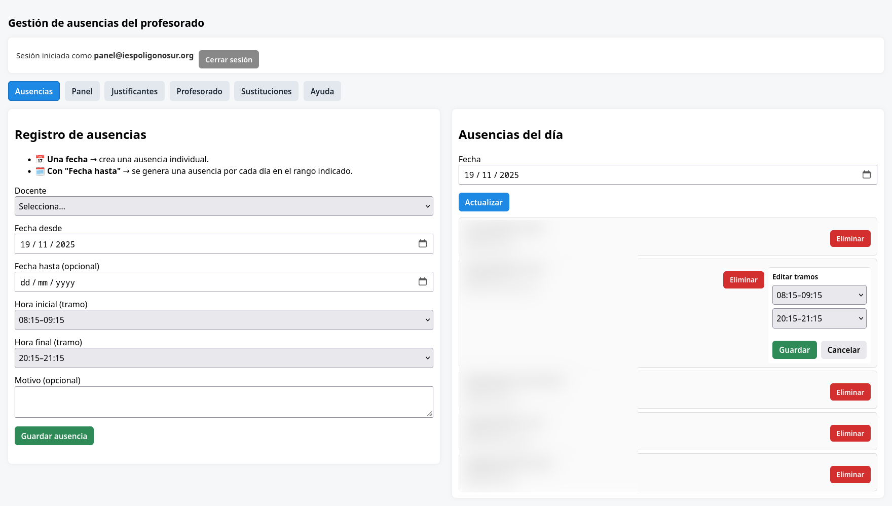
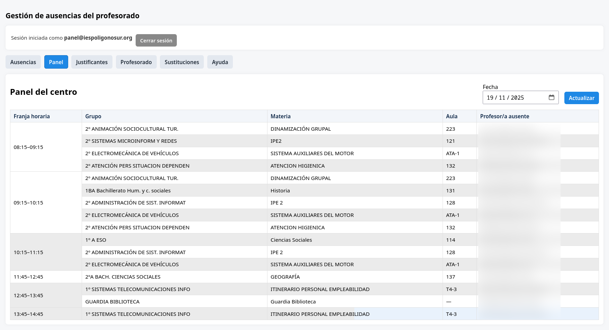
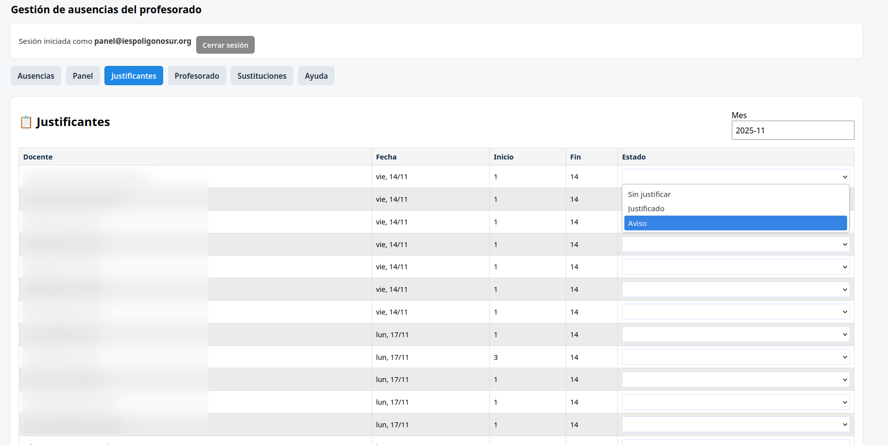
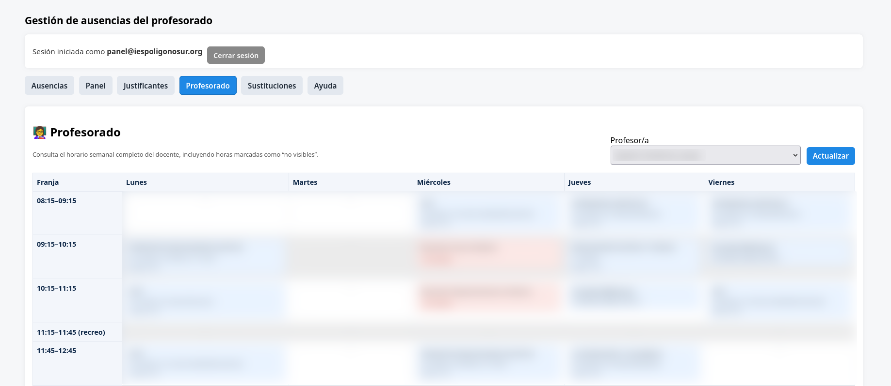
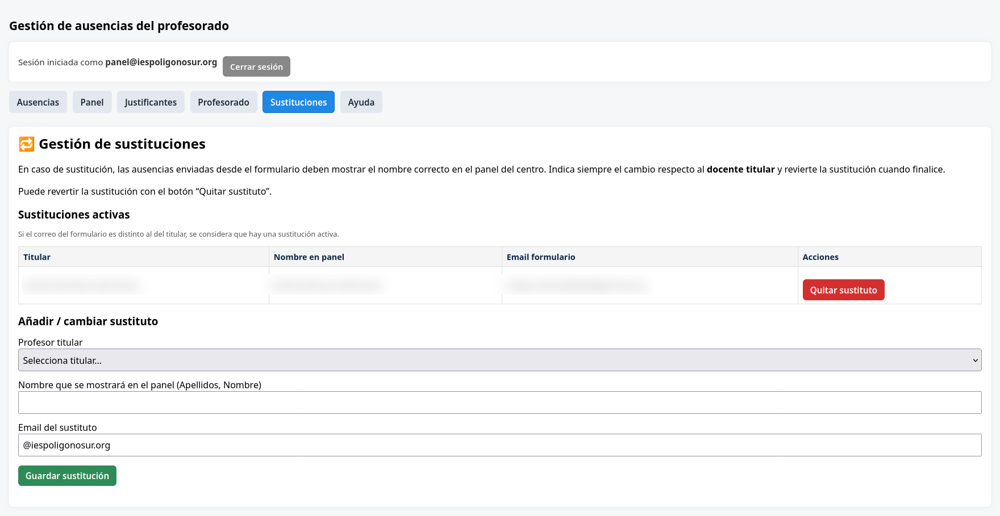

# Gestión de Ausencias del Profesorado — IES Polígono Sur

Proyecto web para la gestión de ausencias del profesorado, generación automática de clases a cubrir y administración de sustituciones. 
Integra Google Forms + Apps Script y Supabase. Los horarios del profesorado se importan desde **HORW** (software de gestión de horarios) directamente en Supabase. 


---

## Estado actual (resumen rápido)

- Interfaz migrada a Vue 3 (single-file-lite en `index.html` + `script.js`).
- Tramos horarios: 14 tramos (4 y 11 son recreos). Tramos definidos en la UI con selects.
- Integración activa con Supabase; las consultas al horario (`timetable`) se filtran por profesor para mejorar rendimiento.
- La vista de horario unifica registros del mismo aula y materia concatenando grupos (evita duplicados por desdobles/optativas).
- El panel de clases a cubrir agrupa por tramo y usa rowspan para no repetir la columna del tramo.
- Impresión optimizada: media query `@media print` para imprimir la tabla en horizontal.
- Ayuda actualizada in-app (`#help-section`) con instrucciones sobre Google Classroom, tramos por defecto y vínculo con la TV de Sala del Profesorado.
- La versión actual no contempla la carga de nuevos archivos CSV directamente desde la web, pero está en la hoja de ruta.

---

## Funcionalidades principales

### Registro de ausencias
- Formulario para registrar ausencias individuales o en rango (genera una ausencia por día).
- Selección de tramos (selects con valores 1..14).
- Por defecto las ausencias se crean como día completo (tramos 1–14). Si el profesor se reincorpora, editar los tramos para que deje de aparecer en el panel.
- Las ausencias también se guardan automáticamente cuando el profesorado rellena el Google Form (Apps Script envía a Supabase).

### Panel de clases a cubrir
- Agrupa las clases por tramo horario; filas del mismo tramo se unifican visualmente.
- Calcula qué clases quedan sin docente y muestra la información pública necesaria (sin motivos/observaciones).
- Lo que ves en el panel es exactamente lo que se visualiza en la TV de la Sala del Profesorado (tras actualizar el panel).

### Horario del profesorado
- Selecciona un docente para cargar su horario semanal.
- Las entradas del mismo día/tramo que comparten aula y materia se unifican concatenando grupos.

### Gestión de sustituciones
- Listado y alta/baja de sustitutos.
- Detección automática comparando `email_form` y `email` del titular.

### Seguridad y privacidad
- Motivos/observaciones no se muestran en paneles públicos.
- RLS en Supabase y autenticación con Supabase Auth para la gestión.

---

## Capturas


<div style="text-align:center;">
<h2>Capturas de pantalla</h2>


<br>




</div>


---

## Desarrollo y puesta en marcha local

1. Clonar y abrir el proyecto:
   ```
   git clone <repo>
   cd gestion-ausencias
   ```

2. Servidor estático simple (Linux):
   ```
   python3 -m http.server 8000
   # abrir http://localhost:8000/index.html
   ```

3. Archivo con credenciales Supabase: revisar `script.js` (URL y clave anónima). Para producción usa variables de entorno y RLS.

---

